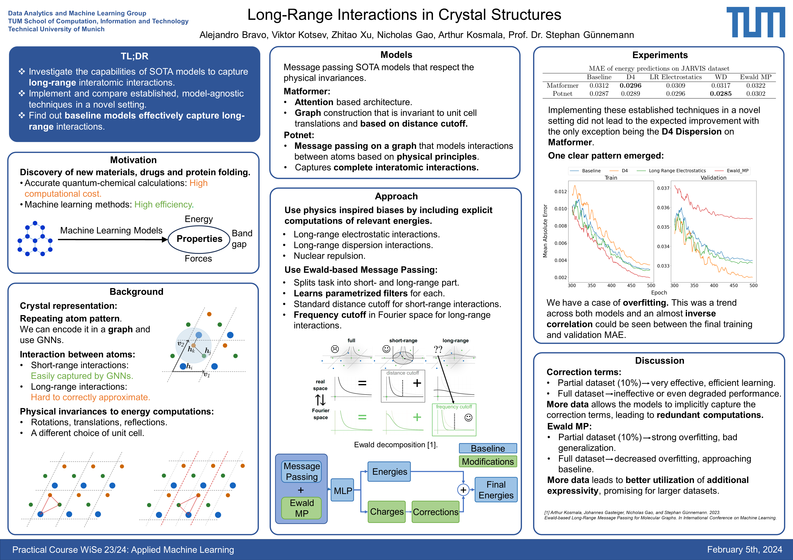

# Long-Range Interactions in Crystal Structures

This repository contains the code and resources used in the practical course "Long-Range Interactions in Crystal Structures", conducted by the Data Analytics and Machine Learning Group at the Technical University of Munich (TUM). Our work investigates the capabilities of state-of-the-art (SOTA) models to capture long-range interatomic interactions within crystal structures, with a focus on exploring if the three physics-inspired biases on the target (energies) will help lower the prediction error.

## Motivation

The discovery of new materials, drugs, and the process of protein folding are crucial areas of research. Traditional quantum-chemical calculations, while accurate, are computationally expensive. Machine learning offers a more efficient alternative, but capturing the complex long-range interactions between atoms remains a challenge.

## Approach

We employ physics-inspired biases, including explicit computations for:
- Long-range electrostatic interactions
- Long-range dispersion interactions
- Nuclear repulsion

Our methodology utilizes Ewald-based Message Passing, which divides the task into short- and long-range components and employs parametrized filters for each. This approach allows for standard distance cutoffs for short-range interactions and frequency cutoffs in Fourier space for long-range interactions.

## Models

- **Matformer**: An attention-based architecture with a graph construction that is invariant to unit cell translations and based on distance cutoffs.
- **Potnet**: Utilizes message passing on a graph to model atom interactions based on physical principles, capturing complete interatomic interactions.

## Experiments and Results

Our experiments show that implementing established techniques in a novel setting did not lead to expected improvements, with the exception of D4 Dispersion on Matformer, indicating a potential for overfitting.

## Discussion

Our findings highlight the challenges and considerations in applying machine learning to capture long-range interactions in crystal structures. The use of partial datasets can lead to efficient learning, but may also introduce overfitting and reduce generalization capabilities.

## Contributors

This project was developed by Alejandro Bravo, Viktor Kotsev, and Zhitao Xu as part of a practical course at TUM.

## Acknowledgements

We would like to express our sincere gratitude to Nicholas Gao, PhD, and Arthur Kosmala, PhD, for their guidance and valuable insights throughout the project. Special thanks to Prof. Dr. Stephan Günnemann for providing the opportunity and resources to explore this topic in the context of the "Applied Machine Learning" course.
